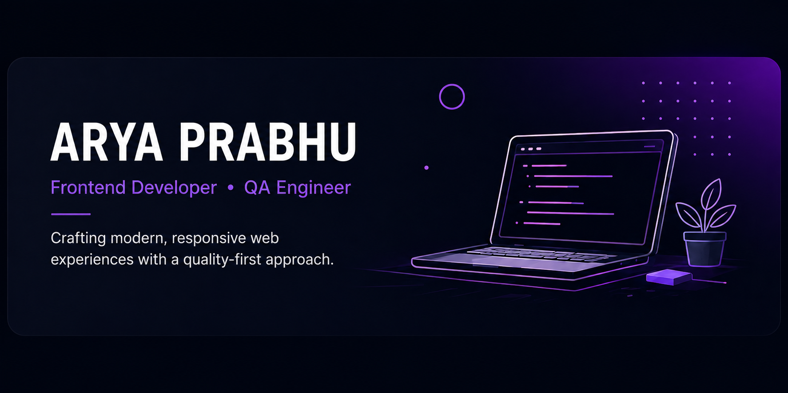

  

<h1 align="center">Hi 👋 I'm Arya Prabhu</h1>

<h3 align="center">
Frontend Developer • QA Engineer
</h3>

Crafting modern, responsive web experiences with a quality-first approach.

---

## 🙋 About Me

I'm a **Frontend Developer** passionate about building clean, responsive and user-friendly web applications.

My experience in **Quality Assurance** has taught me to think beyond writing code—focusing on reliability, usability and attention to detail in every project.

Currently, I'm building modern business websites while continuously improving my frontend development skills through real-world projects.

---

## 🚀 Current Mission

### 🪔 Project Diwali

My goal is to help local businesses establish their online presence through modern, responsive websites while growing into a trusted freelance frontend developer.

### 🎯 Current Focus

- ⚛️ React Development
- 🎨 UI / UX
- 📱 Responsive Design
- ⚡ Performance Optimization
- ✅ Quality Assurance
- 🌐 Freelancing

---

## 🛠 Tech Stack

### Frontend

### Programming Languages

### Tools

### Currently Learning

---

## 📊 GitHub Analytics

---

## 🚀 Featured Projects

| Project | Description | Live Demo | Source Code |
|---------|-------------|-----------|-------------|
| 🍽 **Recipe Finder** | Find recipes using TheMealDB API with React & TailwindCSS | [🔗 Demo](YOUR_RECIPE_DEMO) | [💻 Code](YOUR_RECIPE_REPO) |
| 🏥 **InspireWell** | Hospital appointment booking & symptom checker | [🔗 Demo](YOUR_INSPIREWELL_DEMO) | [💻 Code](YOUR_INSPIREWELL_REPO) |
| 🎬 **Movie Booking System** | Console-based movie ticket booking system in C++ | — | [💻 Code](YOUR_MOVIE_REPO) |
| 🎮 **Missionary Cannibal Game** | AI pathfinding implementation in Python | — | [💻 Code](YOUR_AI_REPO) |

---

## 🌱 Currently Learning

---

## 🤝 Let's Connect

📫 **Email:** aryaprabhu28@gmail.com

💼 **LinkedIn:** https://www.linkedin.com/in/arya-prabhu-a889ba301?utm_source=share&utm_campaign=share_via&utm_content=profile&utm_medium=android_app

🌐 **Portfolio:** Coming Soon 🚀

---

## 💭 My Philosophy

> **"Good software isn't just built—it's tested, refined and crafted."**

I believe great software is more than writing code. It's about creating experiences that are intuitive, reliable and enjoyable to use.

---

⭐ Thanks for visiting my profile! If you like my work, feel free to connect or explore my repositories.

