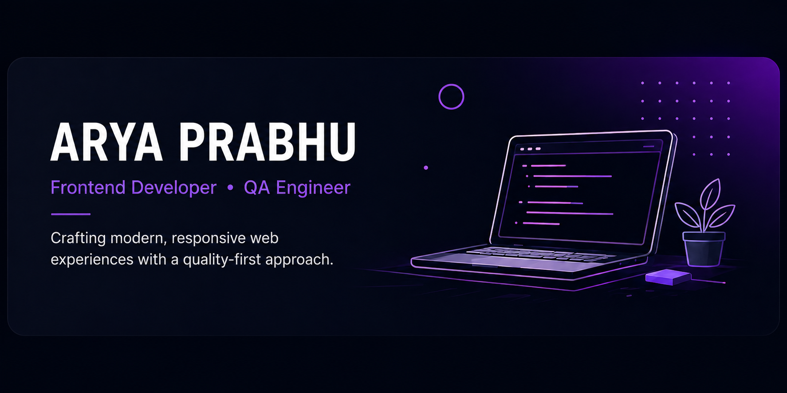

  

<h1 align="center">Hi 👋 I'm Arya Prabhu</h1>

<h3 align="center">
Frontend Developer • QA Engineer
</h3>

Crafting modern, responsive web experiences with a quality-first approach.

---

## 🙋🏻‍♀️ About Me
I'm a Computer Engineering graduate and Frontend Developer passionate about creating modern, responsive and user-friendly web applications.

With experience in Quality Assurance, I bring a quality-first mindset to development, focusing on usability, reliability and attention to detail.

I'm currently exploring freelance web development, building websites for businesses and individuals while continuously growing my technical skills.

---

## 🚀 Current Mission

My freelance journey to help small businesses build a strong online presence through modern, responsive and user-friendly websites.

My goal: Turn ideas into functional digital experiences while building my portfolio, gaining real-world experience and growing as a freelance engineer.

Services I'm exploring:

🌐 Business websites
📱 Responsive landing pages
🎨 Website redesigns
⚡ Performance and usability improvements

---

## 🛠 Tech Stack

### Frontend

### Programming Languages

### QA Automation tools

---

## 📊 GitHub Analytics

---

## 🚀 Featured Projects

| Project | Description | Live Demo | Source Code |
|---------|-------------|-----------|-------------|
| 🍽 **Recipe Finder** | Find recipes using TheMealDB API with React & TailwindCSS | [🔗 Demo](https://recipe-finder-ruby-phi.vercel.app) | [💻 Code](https://github.com/Arya2809/Recipe-Finder.git) |
| 🏥 **InspireWell** | Hospital appointment booking & symptom checker | — | [💻 Code](https://github.com/Arya2809/Inspirewell.git) |
| 🎬 **Movie Booking System** | Console-based movie ticket booking system in C++ | — | [💻 Code](https://github.com/Arya2809/Movie-Booking-System.git) |
| 🎮 **Missionary Cannibal Game** | AI pathfinding implementation in Python | — | [💻 Code](https://github.com/Arya2809/missionary-cannibal-game.git) |

---

## 🤝 Let's Connect

---

## 💭 My Philosophy

> **"Good software isn't just built—it's tested, refined and crafted."**

I believe great software is more than writing code. It's about creating experiences that are intuitive, reliable and enjoyable to use.

---

⭐ Thanks for visiting my profile! If you like my work, feel free to connect or explore my repositories.

